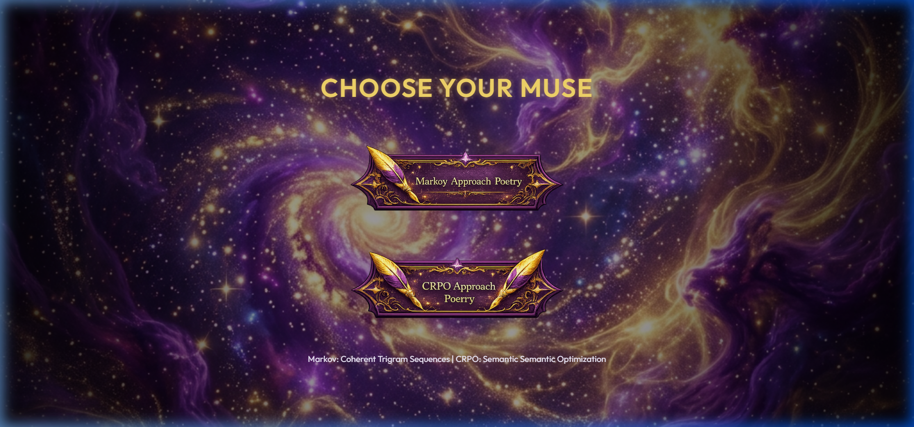
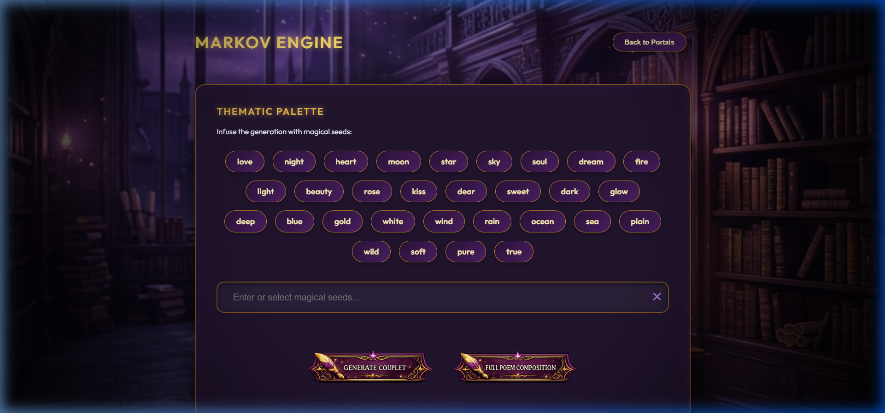

# 🎵 Symphony of Words: Poetry Generation System

A hybrid AI poetry generator featuring **Constrained Markov Processes (CMP)** and **Semantic Optimization (CRPO)**, now presented in a stunning, magical interface.

## ✨ New Fantasy UI
We have unified the generation engines into a single, premium web application with a **Purple & Gold Fantasy** theme.


*Choose your muse through animated magical portals.*


*Infuse your verses with thematic seeds in the mystical library.*

## 🚀 How to Run
To experience the new unified interface locally, run:
```powershell
python app.py
```
Access the app at: **http://127.0.0.1:8000**

---

## 🧠 Generation Engines
1.  **Constrained Markov Process (CMP)**: Matrix-based constraint satisfaction for rhythmic and rhyming coherence.
2.  **CRPO (Semantic Optimization)**: Genetic-inspired semantic selection from the Gutenberg Poetry Corpus.

## 🎨 Design System
*   **Palette**: Deep Royal Purple, Bright Gold, and Neon Violet.
*   **Animations**: Sliding portal transitions and golden glow effects.
*   **Assets**: Custom-designed buttons with integrated typography.
